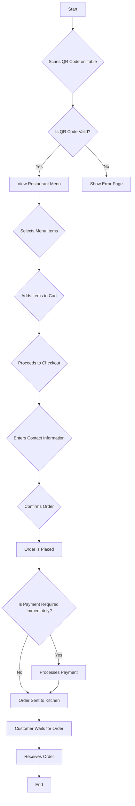

# Customer Flow

This document outlines the typical flow for a customer using the JhiGuCocina application.

```mermaid
graph TD
    A[Start] --> B{Scans QR Code on Table};
    B --> C{Is QR Code Valid?};
    C -- Yes --> D[View Restaurant Menu];
    C -- No --> E[Show Error Page];
    D --> F{Selects Menu Items};
    F --> G{Adds Items to Cart};
    G --> H{Proceeds to Checkout};
    H --> I{Enters Contact Information};
    I --> J{Confirms Order};
    J --> K[Order is Placed];
    K --> L{Is Payment Required Immediately?};
    L -- Yes --> M[Processes Payment];
    L -- No --> N[Order Sent to Kitchen];
    M --> N;
    N --> O[Customer Waits for Order];
    O --> P[Receives Order];
    P --> Q[End];
```
