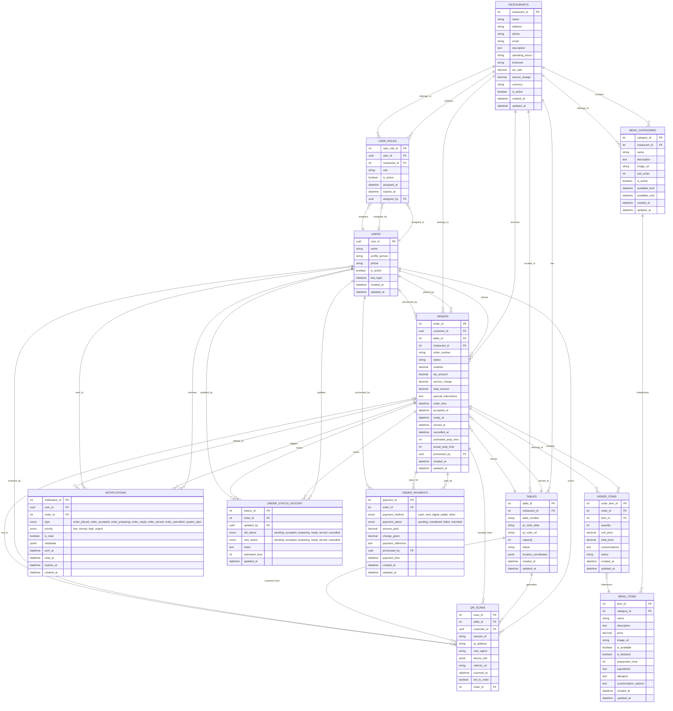

# JhiGuCocina Database ER Diagram

## Key Features of the Schema:

### 🔐 **Multi-tenant Architecture**

- Each restaurant has its own isolated data
- Users can have roles across multiple restaurants

### 📱 **QR Code Ordering System**

- Tables have unique QR codes for customer ordering
- Tracks QR scans and session management

### 🍽️ **Menu Management**

- Hierarchical menu structure (categories → items)
- Support for availability windows and customization

### 📋 **Order Processing**

- Complete order lifecycle tracking
- Status history for audit trails
- Payment processing integration

### 🔔 **Notification System**

- Real-time notifications for order updates
- Configurable priority levels and types

### 📊 **Analytics Ready**

- QR scan tracking for conversion analysis
- Order timing and performance metrics
- User behavior tracking

### 🛡️ **Security & Compliance**

- Row Level Security (RLS) policies
- Audit trails for all critical operations
- Role-based access control
